## 第一讲  计算机基本结构（Basic Components of a Computer）

> 内容要点：冯·诺伊曼结构，计算机执行指令的过程

### 1.1 电子计算机的兴起——“现代电子计算机之父”冯·诺依曼

- *1939年，艾奥瓦州立大学，约翰·阿塔纳索夫、克利夫·贝里，ABC计算机*
- 1946年2月14日，美国宾夕法尼亚大学，约翰·莫克利、约翰·埃克特，世界上第一台**通用**电子计算机ENIAC *（Electronic Numerical Integrator And Computer，电子数字积分器和机算器，18000个电子管、十进制、每秒5000次加法、150千瓦、170平方米、30吨、50万美元）*
  - 冯·诺依曼对ENIAC的分析：ENIAC的开关定位和转插线只不过代表着一些数字信息，完全可以像受程序管理的数据一样，存放于主存储器中。（**“存储程序”的概念**）
  - 1945年6月30日，冯·诺依曼《关于EDVAC的报告草案》*（美国陆军军械部-宾夕法尼亚大学摩尔电机工程学院）*：该报告所描述的计算机结构，即为“冯·诺依曼计算机结构”
    - 1949年5月6日，英国剑桥大学数学实验室，莫里斯·威尔克斯，以EDVAC为蓝本设计和建造的EDSAC（Electronic Delay Storage Automatic Calculator，电子延迟储存自动计算机）：第一台**实用的**储存程序式计算机
      - 五个组成部分：
        - 运算器和控制器：电子管
        - 存储器：水银延迟线
        - 输入设备：从穿孔纸带输入
        - 输出设备：电传打印机
    - 1949年8月交付的EDVAC *（Electronic Discrete Variable Automatic Computer，离散变量电子计算机）* 的主要特点：
      - 实现“存储程序”概念，大幅提升了任务效率
      - 指令和数据采用二进制，极大简化了逻辑线路
      - 由五个基本部分组成：运算器，控制器，存储器、输入设备，输出设备
    - 1951年，计开始于埃克特-莫克利计算机公司（EMCC）完成于雷明顿·兰德公司（Remington Rand）的UNIVAC *（UNIVersal Automatic Computer，每秒10万次加法，主频2.25MHz）* 交付美国人口普查局
      - 1952年，UNIVAC统计选票率先准确预测艾森·豪威尔赢得选举，因此和电子计算机获得了广泛的关注
      - UNIVAC：开启了商用计算机的时代
        - 1950年代，众多公司进入电子计算机领域
        - 1953年，IBM成功转型，推出大型计算机IBM701
        - 1955年，IBM占领了70％的市场（“IBM和七个小矮人”：Burroughs，Sperry Rand(UNIVAC)， CDC，Honeywell，GE，RCA，NCR）

### 1.2 冯·诺依曼结构的要点

- 冯·诺依曼和《关于EDVAC的报告草案》

  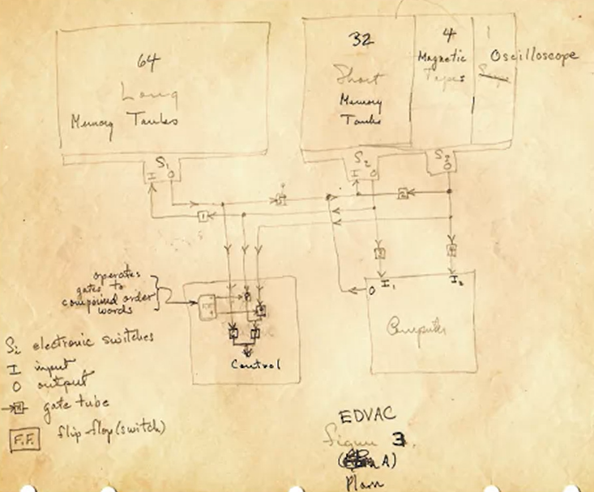

  - 长度101页，未完成稿
  - 论述了**两个重要设计思想**
    - **存储程序**（而不是开关连线）
    - **二进制**（而不是十进制：导致计算机内部结构异常复杂）
  - 明确了**计算机的五个部分：运算器、控制器、储存器、输入设备、输出设备**

- 1971年，世界上第一个商业微处理器Intel 4004

  - 面积：4.2mmx3.2mm

  - 制造工艺：10微米

  - 晶体管数量：2250

  - 主频：最高740KHz，性能与ENIAC相当

  - 字长：4位

  - 1971年最初用于计算器Busicom 141-PF

    - MCS-4（Micro Computer Set）芯片组

      | 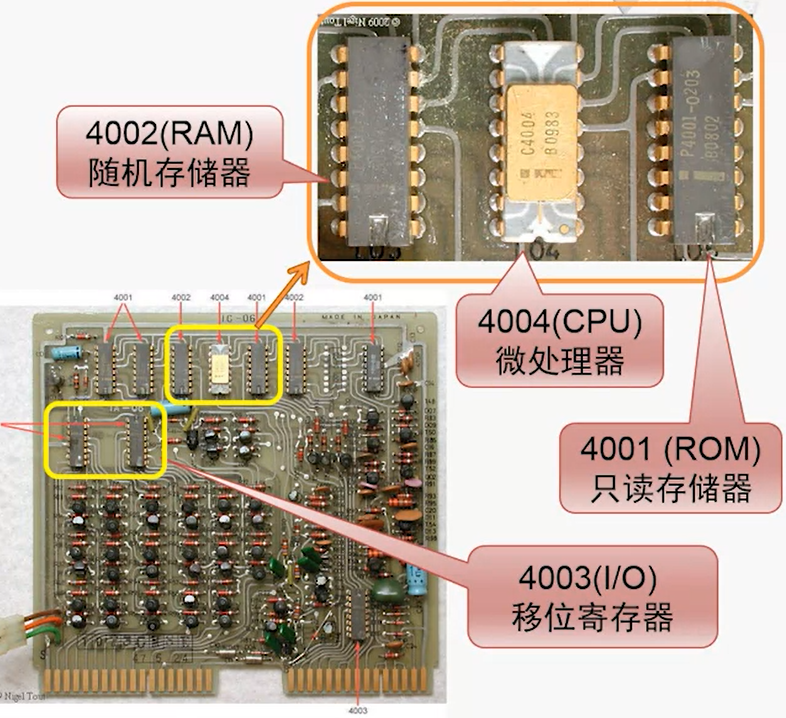 | 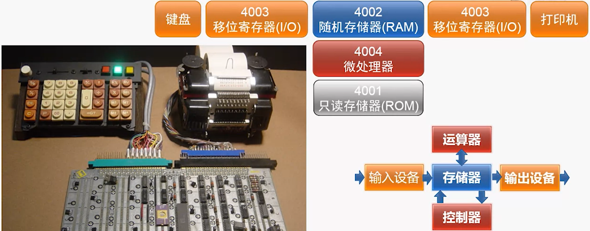 |
      | ----------------------------------------------- | ----------------------------------------------- |

- **冯·诺依曼结构的要点**

  - 计算机的五大组成部分

    1. 运算器，CA：central arithmetical
    2. 控制器，CC：central control
    3. 存储器，M：memory
    4. 输入设备，I：input
    5. 输出设备，O：output

  - **数据和程序**均以**二进制代码**形式不加区别地**存放在存储器**中，存放位置由存储器的地址指定

    - 冯·诺依曼结构的核心

      | 冯·诺依曼结构             | 现代计算机                     |
      | ------------------------- | ------------------------------ |
      | 运算器CA和控制器CC，合称C | CPU（Central Processing Unit） |
      | 存储器M                   | 主存储器（主存、内存）         |

      

      - 主存的组织形式：地址（二进制，每个储存单元对应的序号）+内容（二进制，储存单元中存放的信息，1个存储单元1个字节/8位）

  - 计算机在工作时能够**自动**地从存储器中**取出指令**加以执行

    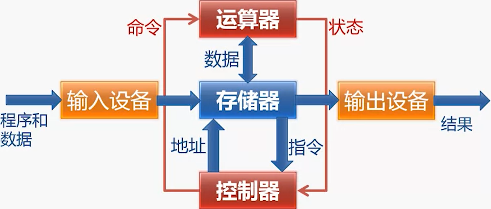

    - 执行指令：计算机运转的核心内容
      - 主要步骤：**取指（Fetch）→译码（Decode）→执行（Execute）→回写（Write-back）**


### 1.3 计算机结构的简化模型（模型机）

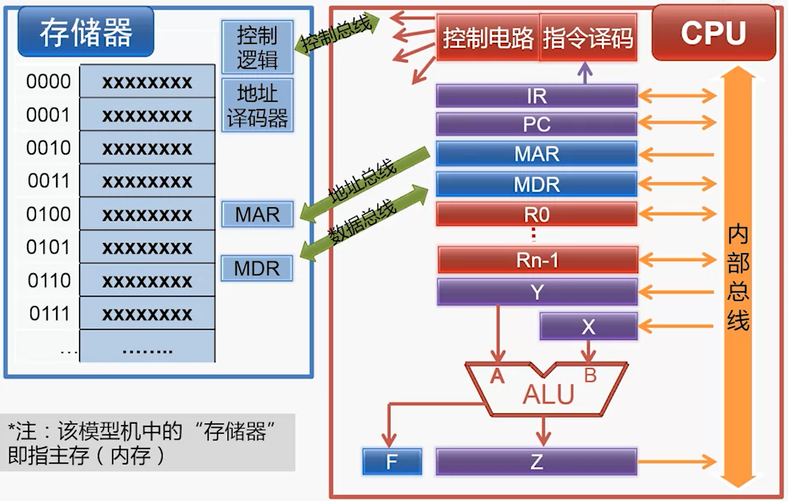

- 存储器
  - 存储单元的位宽：由编址方法确定（按字节编址，每个储存单元存放8位二进制数）
  - 存储单元的地址：唯一的，不同存储单元地址互不相同
  - 地址总线：宽度为$n$，CPU能管理的存储单元最多$2^n$个（32位宽地址总线，内存最多4G）
    - MAR：Memory Address Register，用于存放CPU正在读或写的存储单元的地址
  - 数据总线：宽度一般为存储单元位宽的整数倍
    - MDR：Memory Data Register，用于存放CPU正在读出或即将写入存储单元的数据
  - 控制总线：传输读、写、完成等控制信号
- CPU
  - 控制器：用于控制计算机各部件完成取指令、分析指令和执行指令等功能
    1. 指令寄存器IR：Instruction Register，存放正在执行或者即将执行的指令
    2. 程序计数器PC：Program Counter：存放下一条指令的存储单元**地址**，具有自动增量计数的功能
    3. 存储器地址寄存器MAR：Memory Address Register，在访存时用于存放存储单元的地址
    4. 存储器数据寄存器MDR：Memory Data Register，在访存时用于存放对存储单元读/写的数据
    5. 指令译码部件：对IR中的指令进行译码，已确定IR中存放的是哪一条指令
    6. 控制电路：产生控制信号，在时序脉冲的同步下控制各个部件的动作
  - 运算器：用于算术运算和逻辑运算（常见算术运算：加、减、乘、除等；常见逻辑运算：非、与、或等）
    - ALU：算术逻辑单元，核心部件，用于完成算术运算和逻辑运算
      - ALU对X、Y中的数据进行运算，将结果送到Z。X、Y、Z作为ALU的数据暂存器，可视为ALU的一部分
    - F：标志寄存器，用于存放运算结果的状态（零/正负/进位/溢出）
    - $R_0$~$R_{n-1}$：n个通用寄存器，用于临时存放数据。数据可能来自存储器，也可能来自其他通用寄存器或ALU的输出
  - 内部总线：在CPU各个部件之间传递数据

### 1.4 计算机执行指令的过程

- 执行指令的示例

  - 指令格式：`ADD $R_0$, [6]`

  - 指令功能：通用寄存器$R_0$的内容`+`地址为6的储存单元的内容`=`运算结果

       　　　　<u>↑</u>_____________________________________________<u>更新</u>______________________________________________<u>↓</u>

  - 假设模型机当前状态：

    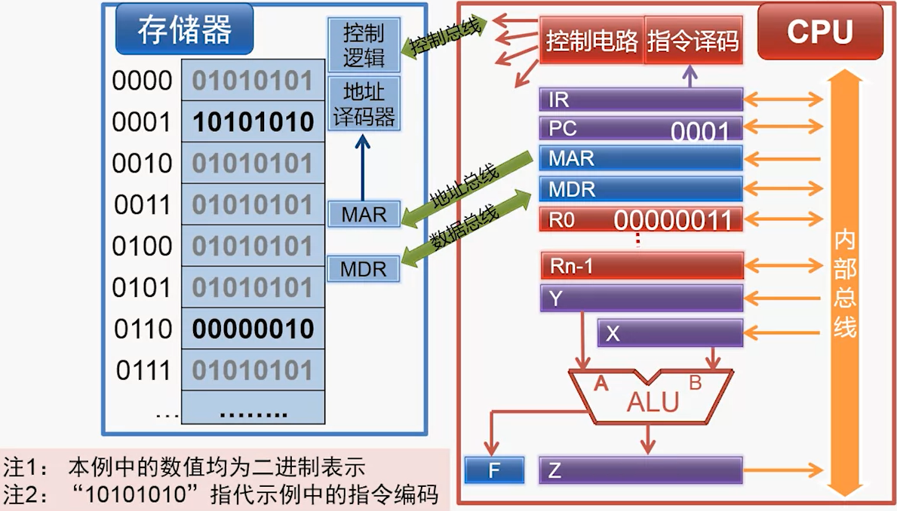

  - 执行过程：

    - 取指

      - 控制器将指令的地址送往存储器：控制器发出控制信号将PC寄存器中的内容通过内部总线传送到MAR中（MAR寄存器：0001）→MAR将这个地址送到地址总线上，控制电路同时在控制总线上发出读操作的控制信号→存储器的MAR寄存器收到地址总线上传送来的地址并保存，存储器中的控制逻辑收到控制总线中传送来的读操作控制信号

        

        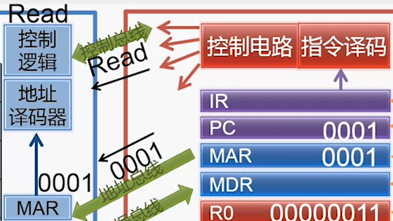

      - 存储器按给定的地址读出指令内容，送回控制器：存储器通过地址译码器 查找到对应地址001的存储单元的内容，并将该存储单元的内容送到MDR寄存器中→存储器的控制逻辑通过控制总线向CPU反馈当前的传输已经准备好了， 同时MDR中的内容送数据总线上→CPU中的控制电路检测到来自控制总线的准备好的ready信号，MDR寄存器就会将当前数据总线上传送来的数值保存下来→MDR将内容传送到IR寄存器→更新PC寄存器为下一条指令的地址

        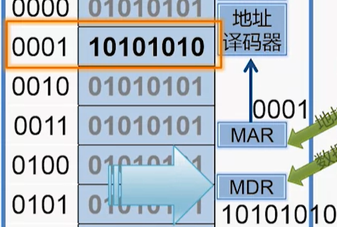

        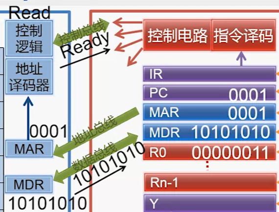

        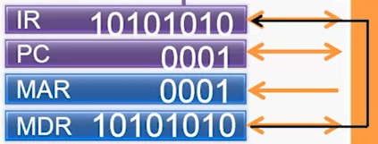

        

    - 译码

      - 控制器分析指令的操作性质：IR寄存器将指令编码送至指令译码部件

        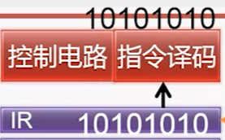

      - 控制器向有关部件发出指令所需的控制信号：译码部件翻译出指令后，控制电路产生相应的控制信号，发送到相关部件中

        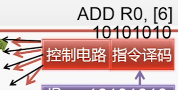

    - 执行

      - 控制器从通用寄存器或存储器取出操作数：控制器在MAR中放置要访问的存储器的地址0110，进行类似于取指阶段的操作→控制器将MDR中的数据暂存到Y寄存器中→控制器将$R_0$的数据传送到X寄存器中

        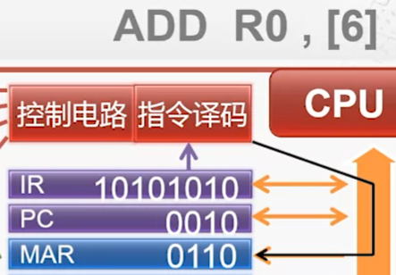

        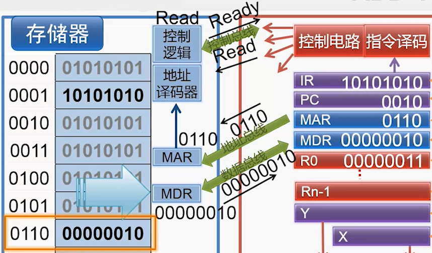

        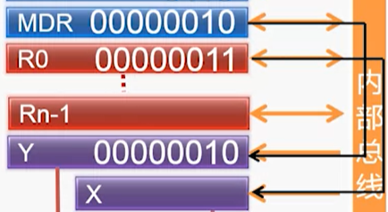

      - 控制器命令运算器对操作数进行指令规定的运算：控制电路命令ALU将X、Y中的内容执行加法并计算出结果

        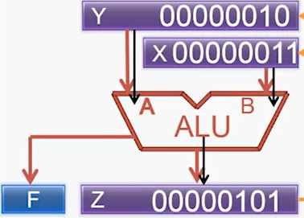

    - 回写：控制电路发出控制信号将Z寄存器当中的内容传送到$R_0$中，覆盖原来的内容

      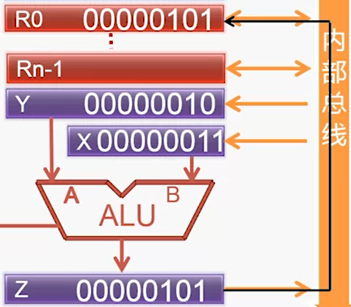

    - 继续执行下一条指令

### 1.5 计算机输入和输出

- 外部记录介质，R：outside recording medium

- 模型机上的输入输出设备

  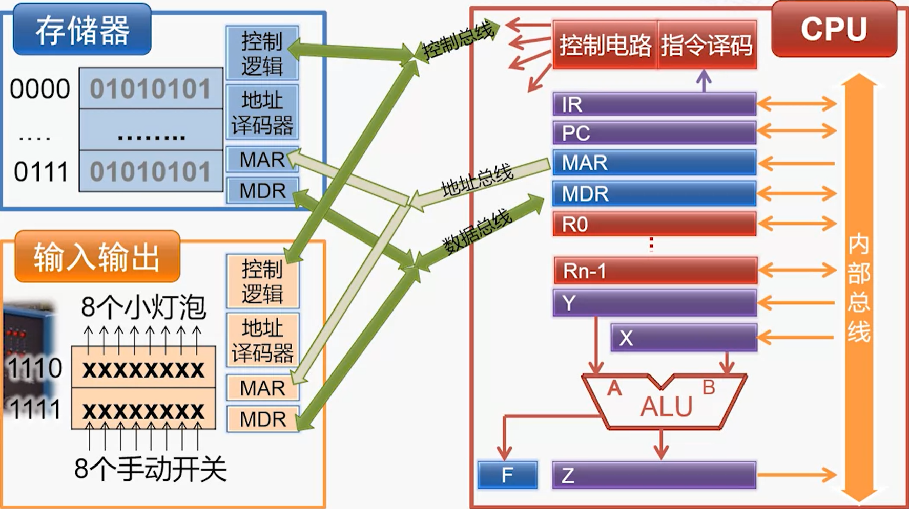

- 现代个人计算机的输入输出

  - 南桥芯片内部包含磁盘键盘、鼠标、音频、网络和USB等多种输入输出设备或接口的控制器
  
    <details>
    <summary>南北桥的演变</summary>


    > 传统来说，主板上两个主要芯片，靠上方的叫北桥，靠下方的叫南桥。
    >
    > 大体上说：北桥负责与CPU通信，并且连接高速设备（内存/显卡），并且与南桥通信；南桥负责与低速设备（硬盘/USB）通信，时钟/BIOS/系统管理/旧式设备控制，并且与北桥通信。
    >
    > Intel从第一代Core i7 (i7 9xx)开始，将原属于北桥功能的内存控制器整合到CPU当中，在主流机Core i中(i7 8xx)更将PCI-e控制器（主要负责连接显卡）整合到CPU当中，这时候传统意义上的北桥的所有功能都已经整合到CPU内部了，所以Intel 50系芯片“组”（X58除外，这是搭配i7 9xx用的，还有北桥）已经没有传统意义的北桥了，而南桥依然负责处理低速设备（SATA/USB/PCI等）、时钟等功能。由于只剩下一个芯片了，也没有“芯片组”的说法了，只剩下孤零零的PCH (Platform Controller Hub)。
    >
    > AMD平台的发展轨迹类似，在K8架构（第一代AMD64处理器）开始就把内存控制器集成到CPU内部，后来先是APU再是桌面的FX系列，陆陆续续把PCI-e控制器也整合到CPU中，也剩下孤零零的FCH (Fusion Controller Hub)……
    >
    > 于是这两家的南桥（PCH/FCH）现在差不多变成了一个PCI-e Hub了……
    
    </details>

  - 部分性能要求高或者用途特殊的输入输出接口采用独立芯片或板卡的形式

### 1.6 冯·诺依曼结构的具体实现

- 南北桥架构的演变

  | 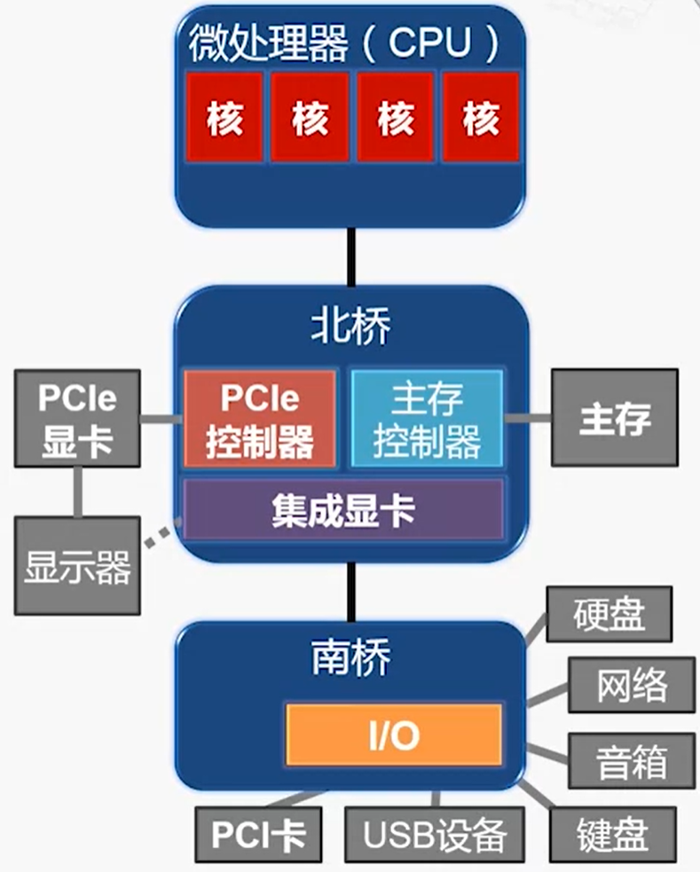 | →    |  | →    | 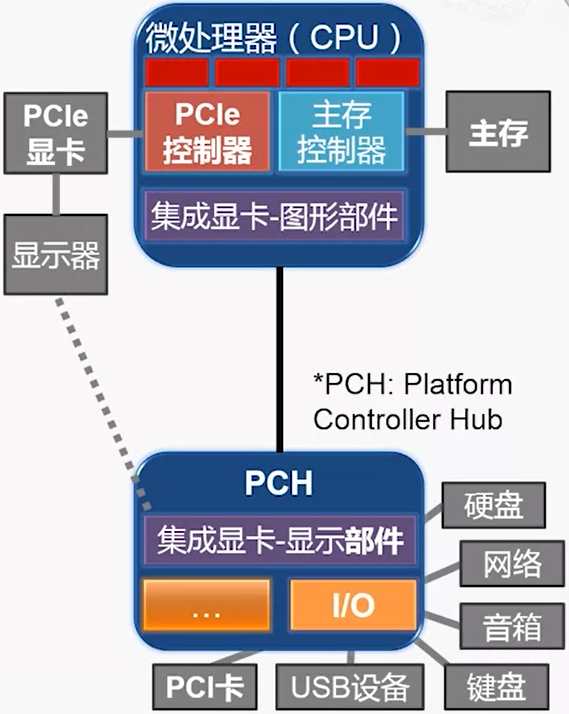 |
  | ----------------------------------------------- | ---- | ---------------------------------------- | ---- | ----------------------------------------------- |

- 系统芯片 System-on-a-Chip，SoC：将计算机或其他电子系统集成为单一芯片的集成电路

  |  | 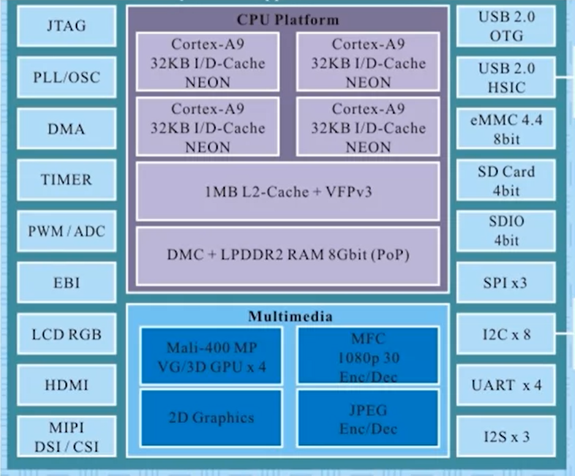 |
  | ----------------------------------------------- | ---------------------------------------- |

## 第二讲  指令系统体系结构（Instruction Set Architecture）

> 内容要点：x86 ISA，MIPS ISA

### 2.1 设计自己的计算机

- 一个简单的计算机指令系统

  | 指令类别   | 指令                                                         |
  | ---------- | ------------------------------------------------------------ |
  | 运算类指令 | `ADD R, M` 功能：将`R`的内容与`M`中的内容相加后存入`R`       |
  | 传送类指令 | `LOAD R,M` 功能：将`M`中的内容装入`R`<br/>`STORE M, R` 功能：将`R`的内容存入`M`中 |
  | 转移类指令 | `JMP L `功能：无条件转向`L`处                                |

  注：`M`和`L`为存储器地址，`R`为寄存器编号

- 指令的格式

  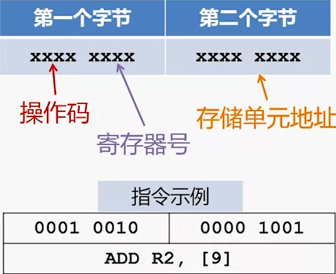

  - 每条指令等长，均为2个字节
  - 第一个字节的高4位是操作码
    - LOAD: 0000; ADD: 0001
    - STORE: 0010; JMP: 0011
    - 目前只提供4条指令，最多可扩展到16条
  - 第一个字节的低4位是寄存器号
    - $R_0\textasciitilde R_3$O: 0000~0011目
    - 前只提供4个寄存器，最多可扩展到16个
  - 第二个字节是存储单元地址
    - 最大可以使用256个字节的存储器

### 2.2 x86体系结构

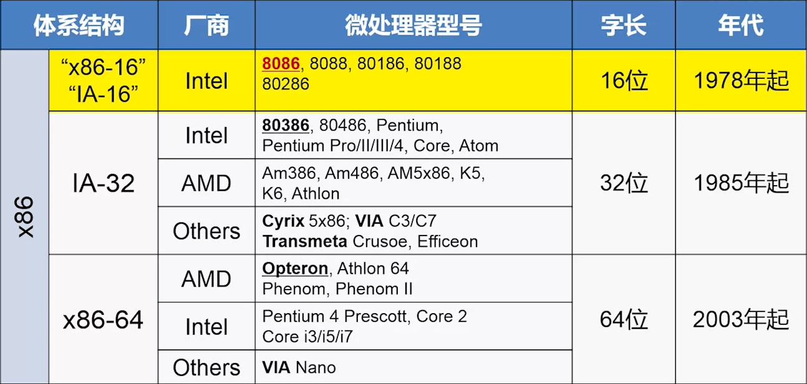

- Intel 8086（1978年）

  

  - 内部的通用寄存器为16位，既能处理16位数据，也能处理8位数据

    - 8086的寄存器模型

      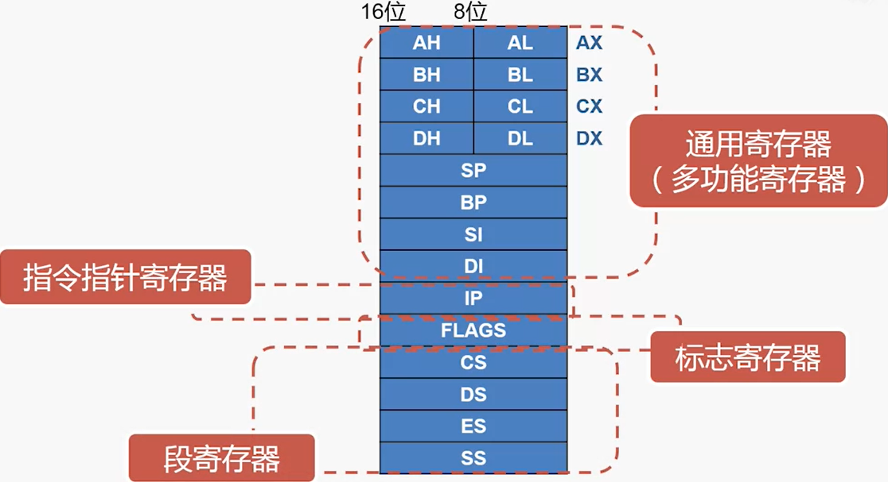

      - 通用寄存器（多功能寄存器）

        - 数据寄存器，共有4个，均为16位寄存器

        - 每个16位寄存器都可分为两个8位寄存器使用

        - 适用大多数算术运算和逻辑运算指令

        - 除存放通用数据外，各有一些专门的用途：

          | AX   | Accumulator | 存放乘除等指令的操作数                    |
          | ---- | ----------- | ----------------------------------------- |
          | BX   | Base        | 存放存储单元的偏移地址                    |
          | CX   | Count       | 存放计数值                                |
          | DX   | Data        | 乘法运算产生的部分积 除法运算的部分被除数 |

      - 标志寄存器：标志位

        - FLAGS寄存器中包含若干标志位

          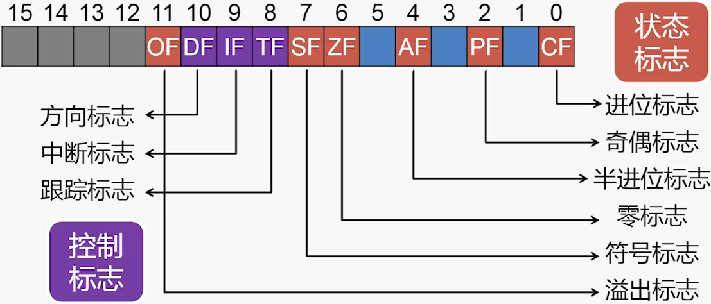

        - 标志位分为两大类：状态标志和控制标志

          - 状态标志：反映CPU的工作状态
            - 例如：执行加法运算时是否产生进位；运算结果是否为零
          - 控制标志：对CPU的运行起特定控制作用
            - 例如：以单步方式还是连续方式运行；是否允许响应外部中断请求

      - 指令指针寄存器 IP（Instruction Pointer）：保存一个内存地址，指向当前需要取出的指令

        - 当CPU从内存中取出一个指令后，IP会自动增加，指向下一指令的地址（注：实际情况会复杂的多）
        - 程序员不能直接对IP进行存取操作
        - 转移指令、过程调用/返回指令等会改变IP的内容
        - IP寄存器的寻址能力：$2^{16}=65536$（64K）字节单元8
        - 8086对外有20位地址线，寻址范围：$2^{20}=1M$字节单元

      - 段寄存器 Segment Register：与其它寄存器联合生成存储器地址

        - CS代码段寄存器 Code Segment
        - DS数据段寄存器 Data Segment
        - ES附加段寄存器 Extra Segment
        - SS堆栈段寄存器 Stack Segment

      - 8086的物理地址生成

        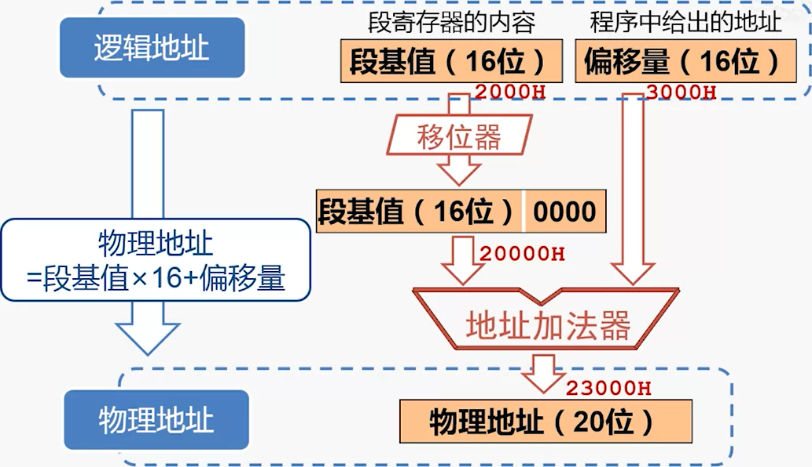

  - 对外有16根数据线和20根地址线可寻址的内存空间为1MByte（220）

  - 物理地址的形成采用段加偏移的方式

- Intel 80386（1985年） *主频12.5~33MHz、27.5万个晶体管*

  - 80x86系列中的第一款32位微处理器

  - 支持32位的算术和逻辑运算，提供32位的通用寄存器

  - 地址总线扩展到32位，可寻址4GB的内存空间

  - 改进了“保护模式”（例如，段范围可达4GB）

  - 增加了“虚拟8086模式”，可以同时模拟多个8086微处理器

    

  - IA-32的寄存器模型

    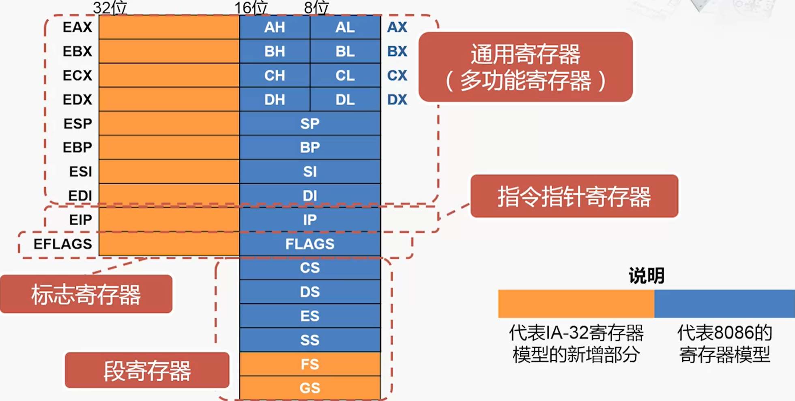

    注：保护模式下，段寄存器有不同的使用方法

- Intel IA-64：独立于x86，不兼容IA-32，并未获得成功

- x86-64（2003年）

  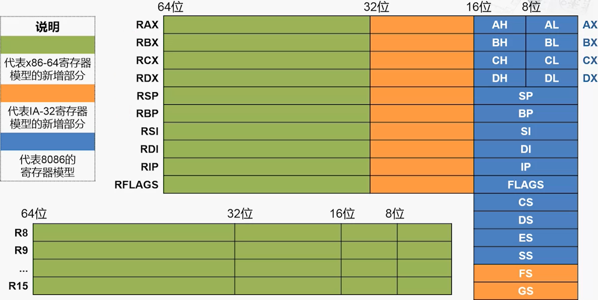

### 2.3 x86指令简介

-  指令的主要类别

  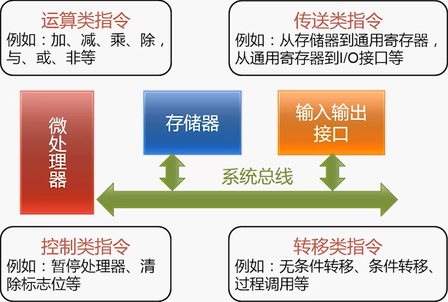

- 指令的运行结果

  - 改变通用寄存器的内容
  - 改变存储器单元的内容
  - 改变标志位
  - 改变指令指针
  - 改变外设端口的内容
  - 其他

- 程序示例

  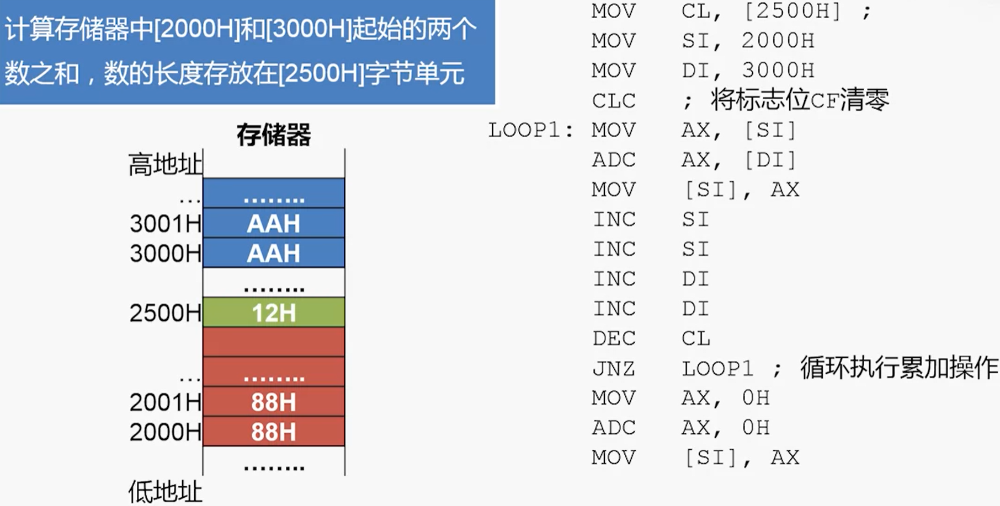

  - 传送指令：把数据或地址传送到寄存器或存储器单元中

    | 分组               | 助记符 | 功能                 | 操作数类型 |
    | ------------------ | :----- | :------------------- | :--------- |
    | 通用数据传送指令   | MOV    | 传送                 | 字节/字    |
    |                    | PUSH   | 压栈                 | 字         |
    |                    | POP    | 弹栈                 | 字         |
    |                    | XCHG   | 交换                 | 字节/字    |
    | 累加器专用传送指令 | XLAT   | 换码                 | 字节       |
    |                    | IN     | 输入                 | 字节/字    |
    |                    | OUT    | 输出                 | 字节/字    |
    | 地址传送指令       | LEA    | 装入有效地址         | 字         |
    |                    | LDS    | 把指针装入寄存器和DS | 4个字节    |
    |                    | LES    | 把指针装入寄存器和ES | 4个字节    |
    | 标志传送指令       | LAHF   | 把标志装入AH         | 字节       |
    |                    | SAHF   | 把AH送标志寄存器     | 字节       |
    |                    | PUSHF  | 标志压栈             | 字         |
    |                    | POPF   | 标志弹栈             | 字         |

    - MOV指令

      - 格式：`MOV DST, SRC`

      - 操作：DST←SRC，把一个操作数从源传送至目的，源操作数保持不变

      - 寻址方式示例

        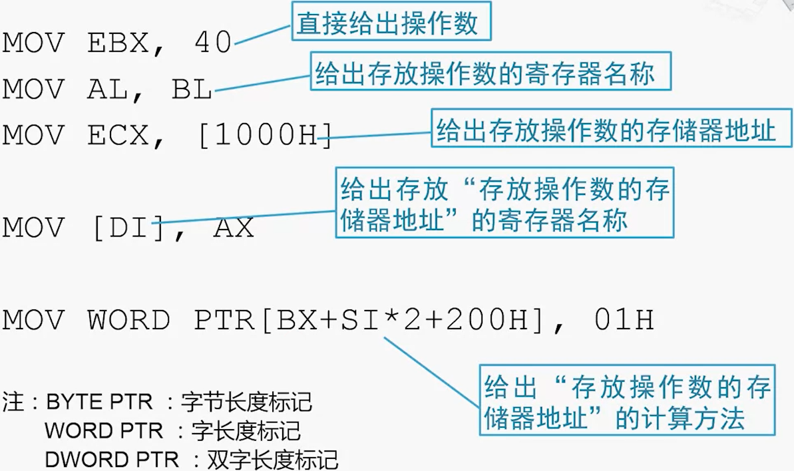

      - 编码示例：*变长指令*

        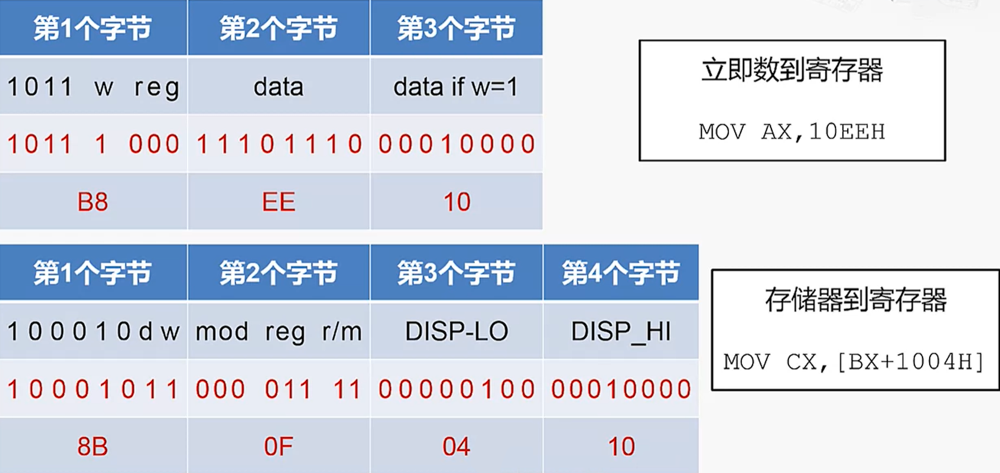

  - 运算指令

    - 逻辑运算和移位指令/位操作指令：实现对二进制位的操作和控制

      | 分组     | 助记符 | 功能           |
      | :------- | :----- | -------------- |
      | 逻辑运算 | NOT    | 逻辑非         |
      |          | AND    | 逻辑与         |
      |          | OR     | 逻辑或         |
      |          | XOR    | 逻辑异或       |
      |          | TEST   | 逻辑测试       |
      | 移位     | SHL    | 逻辑左移       |
      |          | SAL    | 算术左移       |
      |          | SHR    | 逻辑右移       |
      |          | SAR    | 算术右移       |
      | 循环移位 | ROL    | 循环左移       |
      |          | ROR    | 循环右移       |
      |          | RCL    | 带进位循环左移 |
      |          | RCR    | 带进位循环右移 |

      - 操作数的限制
        - 对于单操作数指令，操作数不能是立即数
        - 对于双操作数指令，限制与`MOV`指令相同

    - 算术运算指令：完成加、减、乘、除等算术运算，提供运算结果调整、符号扩展等功能

      | 分组 | 助记符 | 功能           |
      | :--- | :----- | :------------- |
      | 加法 | ADD    | 加             |
      |      | ADC    | 加（带进位）   |
      |      | INC    | 加1            |
      | 减法 | SUB    | 减             |
      |      | SBB    | 减（带借位）   |
      |      | DEC    | 减1            |
      |      | NEG    | 取补           |
      |      | CMP    | 比较           |
      | 乘法 | MUL    | 乘（不带符号） |
      |      | IMUL   | 乘（带符号）   |
      | 除法 | DIV    | 除（不带符号） |
      |      | IDIV   | 除（带符号）   |

      - 操作数的限制

        - 目的操作数不能是立即数或CS寄存器
        - 两个操作数不能同时为存储器操作数

      - 加法类指令

        ```assembly
        ADD BL, 8
        ADD WORD PTR[BX], DX
        
        ADD EAX, ECX
        ADC EBX, EDX
        ;EBX:EAX+EDX:ECX
        
        INC CL
        ```

        - ADD指令（加）

          - 格式：`ADD DST, SRC`
          - 操作：DST←DST+SRC

        - ADC指令（带进位的加）

          - 格式：`ADC DST, SRC`
          - 操作：DST←DST+SRC+CF

        - INC指令（加1）

          

          - 格式：`INC OPR`
          - 操作：OPR←OPR+1

  - 转移指令：改变指令执行顺序

    - 根据是否有判断条件，分为无条件转移指令和条件转移指令两大类

    - 根据转移目标地址的提供方式，可分为直接转移和间接转移两种方式

      |                    | **直接转移** | **间接转移** |
      | ------------------ | ------------ | ------------ |
      | **无条件转移指令** |              |              |
      | **条件转移指令**   |              |              |

      - 条件转移指令：根据某一状态标志转移

        | 分组                 | 格式          | 功能                | 测试条件 |
        | -------------------- | :------------ | :------------------ | :------- |
        | 根据某一状态标志转移 | JC LABEL      | 有进位时转移        | CF=1     |
        |                      | JNC LABEL     | 无进位时转移        | CF=0     |
        |                      | JP/JPE LABEL  | 奇偶位为1时转移     | PF=1     |
        |                      | JNP/JPO LABEL | 奇偶位为0时转移     | PF=0     |
        |                      | JZ/JE LABEL   | 为零/相等时转移     | ZF=1     |
        |                      | JNZ/JNE LABEL | 不为零/不相等时转移 | ZF=0     |
        |                      | JS LABEL      | 负数时转移          | SF=1     |
        |                      | JNS LABEL     | 正数时转移          | SF=0     |
        |                      | JO LABEL      | 溢出时转移          | OF=1     |
        |                      | JNO LABEL     | 无溢出时转移        | OF=0     |
        | 对无符号数 |JB/JNAE LABEL|低于/不高于等于时转移|CF=1|
    | |JNB/JAE LABEL|不低于高于等于时转移|CF=0|
    | |JA/JNBE LABEL|高于/不低于等于时转移|CF=0且ZF=0|
    | |JNA/JBE LABEL|不高于/低于等于时转移|CF=1或ZF=1|
    | 对有符号数 |JL/JNGE LABEL|小于/不大于等于时转移|SF≠OF|
    | |JNL/JGE LABEL|不小于/大于等于时转移|SF=OF|
    | |JG/JNLE LABEL|大于/不小于等于时转移|ZF=0且SF=OF|
    | |JNG/JLE LABEL|不大于/小于等于时转移|ZF=1或SF≠OF|

  - 控制指令：控制CPU的功能；对标志位进行操作

    | 分组         | 格式 | 功能                 |
    | ------------ | :--- | :------------------- |
    | 标志操作指令 | STC  | 把进位标志CF置1      |
    |              | CLC  | 把进位标志CF清0      |
    |              | CMC  | 把进位标志CF取反     |
    |              | STD  | 把方向标志DF置1      |
    |              | CLD  | DF清0把方向标志      |
    |              | STI  | 把中断标志IF置1      |
    |              | CLI  | 把中断标志IF清0      |
    | 外同步指令   | HLT  | 暂停                 |
    |              | WAIT | 等待                 |
    |              | ESC  | 交权                 |
    |              | LOCK | 封锁总线（指令前缀） |
    | 空操作       | NOP  | 空操作               |

### 2.4 复杂的x86指令举例

- 串操作

  | 分组       | 助记符              | 功能                           |
  | :--------- | :------------------ | :----------------------------- |
  | 串操作指令 | MOVS (MOVSB, MOVSW) | 串传送（字节串传送，字串传送） |
  |            | CMPS (CMPSB, CMPSW) | 串比较（字节串比较，字串比较） |
  |            | SCAS (SCASB, SCASW) | 串扫描（字节串扫描，字串扫描） |
  |            | LODS (LODSB, LODSW) | 取串（取字节串，取字串）       |
  |            | STOS (STOSB, STOSW) | 存串（存字节串，存字串）       |
  | 重复前缀   | REP                 | 无条件重复前缀                 |
  |            | REPE/REPZ           | 相等/为零重复前缀              |
  |            | REPNE/REPNZ         | 不相等/不为零重复前缀          |

  - 作用

    - 对存储器中的数据串进行每次一个元素的操作
    - 串的基本单位是字节或字（即“一个元素”）
    - 串长度可达64KB

  - 分类

    - 共5条串操作指令

      - MOVSB指令（字节串传送）

          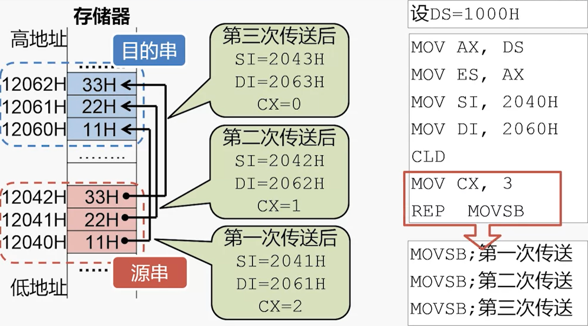

        - 格式：`MOVSB`

        - 操作：在存储器中将指定位置的一个字节单元传送到另一个指定的位置

        - 隐含操作数

          - 源串地址为`DS:SI`，目的串地址为`ES:DI`
          - 串的长度在CX寄存器中

        - 处理完一个串元素后的操作（硬件自动完成）

          - 修改SI和DI，指向下一个串元素
          - 若使用重复前，则CX←CX-1

        - 串传送方向（DF标志位）：应对源串和“目的串的存储区域部分重叠的问题
        
          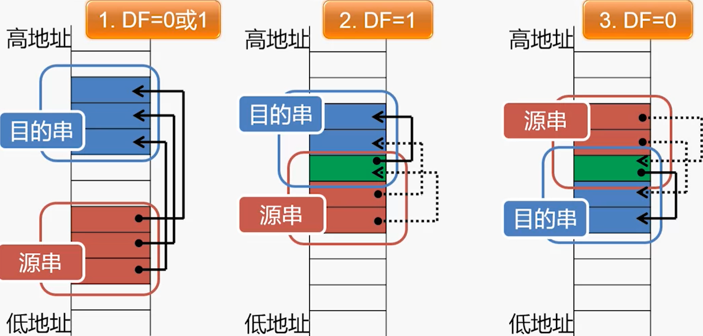
        
          - 设置DF=0
            - 从“源串”的低地址开始传送
            - 传送过程中，SI和DI自动增量修改
          - 设置DF=1
            - 从“源串”的高地址开始传送
            - 传送过程中，SI和DI自动减量修改

    - 另有3种重复前缀，与串操作指令配合使用

      - REP前缀（无条件重复）
        - 格式：`REP 串操作指令`
        - 操作：当CX≠0时，重复执行串操作指令

- “最长的指令”

  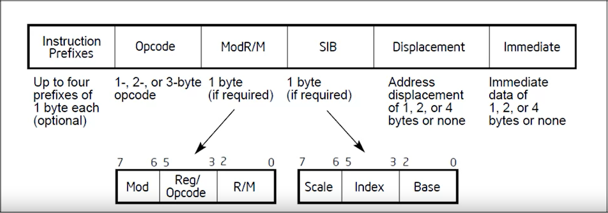

  ```assembly
  LOCK ADD DWORD PTR ES:[EAX+ECX*8+11223344H], 12345678H
  ```

  指令编码：`26 66 67 F0 81 84 C8` `44 33 22 11` `78 56 34 12`（15个字节）

### 2.5 MIPS体系结构

- MIPS指令的发展

  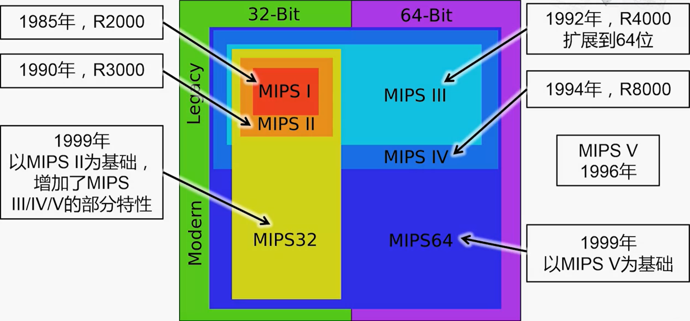

- MIPS的设计指导思想

  - Microprocessor without Interlocked Piped Stages
  - 主要关注点
    - 减少指令的类型
    - 降低指令复杂度
  - 基本原则： A simpler CPU is a faster CPU

- 主要特点

  - 固定的指令长度：32-bit，即1word👉简化了从存储器取指令
  - 简单的寻址模式👉简化了从存储器取操作数
  - 指令数量少，指令功能简单（一条指令只完成一个操作）👉简化指令的执行过程
  - 只有Load和Store指令可以访问存储器👉例如，不支持x86指令的这种操作：`ADD AX, [3000H]`
  - 需要优秀的编译器支持

- MIPS指令示例

  - 运算指令

    - 算术运算
      - 加法指令
        - 格式：`add a, b, c`
        - 操作：将b和c求和，结果放入a中
      - `sub a, b, c`
      - `mul a, b, c`
      - `div a, b, c`
    - 逻辑运算
      - `and a, b, c`
      - `or a, b, c`
    - 移位
      - `sll a, b, c`
      - `srl a, b, c`

  - 访存指令

    > 假设
    >
    > - A是一个100个字（word）的数组，首地址在寄存器$19中
    > - 变量h对应寄存器$18
    > - 临时数据存放在寄存器$8
    >
    > `A[10] = h + A[3]`对应的MIPS指令为
    >
    > ```assembly
    > lw $18, 12($19) # t0 = A[3], 12表示位移 (MIPS中一个字32位)
    > add $8, $18, $8 # t0 = h + A[3]
    > sw $8, 40($19) # A[10] = h + A[3]
    > ```

- MIPS的通用寄存器：32个，每个都是32位宽

  | 编号   | 名称      | 用途                                                  |
  | ------ | --------- | ----------------------------------------------------- |
  | 0      | $zero     | The Constant Value 0                                  |
  | 1      | $at       | Assembler Temporary                                   |
  | 2-3    | \$v0-\$v1 | Values for Function Results and Expression Evaluation |
  | 4-7    | \$a0-\$a3 | Arguments                                             |
  | 8-15   | \$t0-\$t7 | Temporaries                                           |
  | 16-23* | \$s0-\$s7 | Saved Temporaries                                     |
  | 24-25  | \$t8-\$t9 | Temporaries                                           |
  | 26-27  | \$k0-\$k1 | Reserved for OS Kernel                                |
  | 28*    | $gp       | Global Pointer                                        |
  | 29*    | $sp       | Stack Pointer                                         |
  | 30*    | $fp       | Frame Pointer                                         |
  | 31*    | $ra       | Return Address                                        |

  \* Preserved across a call

### 2.6 MIPS指令简介

<details>
<summary>MIPS Green Sheet</summary>

|  | 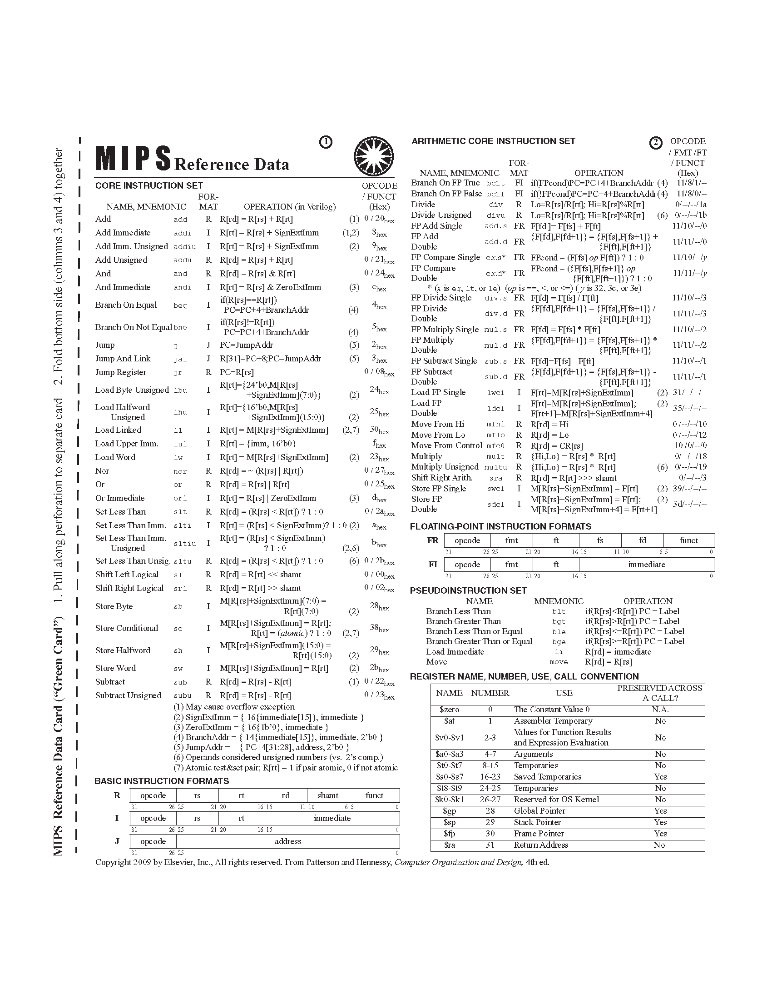 |
| -------------------------------------------------- | ---------------------------------------- |

</details>

- MIPS指令的基本格式

  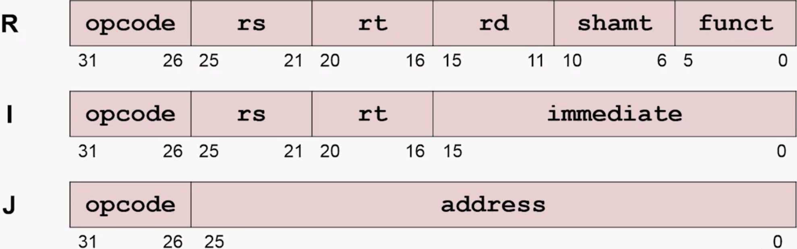

  \* R：Register，寄存器；I：Immediate，立即数；J：Jump，无条件转移

  |              | R型指令                                 | I型指令                                  | J型指令  |
  | ------------ | --------------------------------------- | ---------------------------------------- | -------- |
  | **运算指令** | `add rd, rs, rt`<br>`sll rd, rt, shamt` | `addi rt, rs, imm`<br>`slti rt, rs, imm` | /        |
  | **访存指令** | /                                       | `lw rt, imm(rs)`<br>`sw rt, imm(rs)`     | /        |
  | **分支指令** | `jr rs`                                 | `beq rs, rt, imm`                        | `j addr` |

  - R型指令的格式：包含六个域

    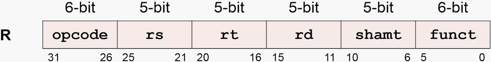

    - 2个6-bit域，可表示0~63
      - opcode：用于指定指令的类型，所有R型指令该域值均为0
      - funct：与opcode域组合，精确地指定指令的类型
    - 4个5-bit域，可表示0~31，对应32个通用寄存器
      - rs：Source Register，通常用于指定第一个源操作数所在的寄存器编号
      - rt：Target Register，通常用于指定第二个源操作数所在的寄存器编号
      - rd：Destination Register，通常用于指定日的操作数（保存运算结果）的寄存器编号
      - shamt：shift amount，用于移位指令进行移位操作的位数；非移位指令该域均为0
    - 示例：`add $8, $9, $10`（opcode=0，funct=32，shamt=0，rd=8，rs=9，rt=10）→`000000 01001 01010 01000 00000 100000`

  - I型指令的格式

    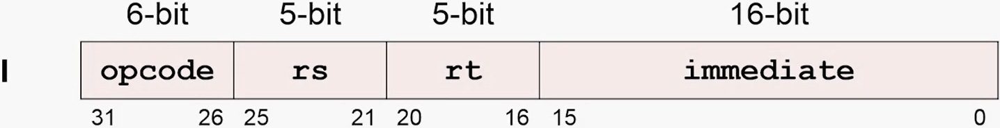

    - immediate域：16-bit的立即数，可以表示$2^{16}$个不同数值
      - 对于访存指令，通常可以满足访存地址偏移量的需求（-32768~+32767）
      - 对于运算指令，无法满足全部需求
    - 示例：`addi $21, $22, -50 # $21 = $22 + (-50)`（opcode=8，rs=22，rt=21，immediate=-50）→`001000 10110 10101` `1111 1111 1100 1110`

  - 分支指令：改变控制流

    - 条件分支（I型）：根据比较的结果改变控制流

      - beq：branch if equal

        - 格式：`beq reg1, reg2, L1`（opcode=4）
        - 操作：`if (value in reg1) == (value in reg2) goto L1`

      - bne：branch if not equal

        - `bne rs, rt, imm`（opcode=5）

      - 示例

        ```c
        if (i == j)
          f = g + h;
        else
          f = g - h;
        ```

        ```assembly
        beq $s3, $s4, True # branch i == j
        sub $s0, $s1, $s2 # f = g - h (false)
        j Fin # goto Fin
        
        True: add $s0, $s1, $s2 # f = g + h (true)
        Fin: ...
        ```

      - 目标地址范围

        - 以当前PC为基准，16-bit位移量可以表示$±2^{15}$bytes
        - MIPS的指令长度固定为32-bit（word）：指令位置一定在四个字节对齐处，指令地址低两位必为0
        - 16-bit位移量可以表示$±2^{15}$words = $±2^{17}$bytes ($±128$KB)

      - 目标地址计算方法

        - 分支条件不成立，`PC = PC + 4 = next instruction`
        - 分支条件成立`PC = (PC + 4) + (immediate * 4)`

    - 非条件分支：无条件地改变控制流

      

      - j（J型）：jump
        - 目标地址范围：$±2^{28}$bytes（$±256$MB）
        - 目标地址计算方法：`New PC = {(PC + 4) [31..28], address, 00}`
      - jr（R型）：jump register
        - 格式：`jr rs`

## 第三讲  算术逻辑单元（Arithmetic Logic Unit）

> 内容要点：逻辑运算，二进制加减法运算，ALU的实现

### 3.1 算术运算和逻辑运算

- 算术运算指令 MIPS Core Instruction Set

  - R型

    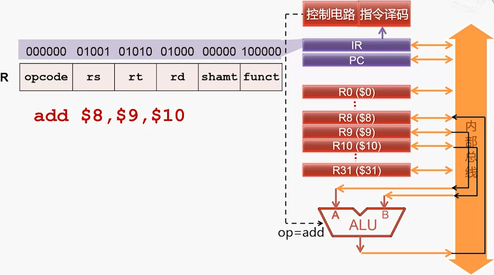

    - `add rd, rs, rt #R[rd] = R[rs] + R[rt]` (1)
    - `addu rd, rs, rt # R[rd] = R[rs] + R[rt]`
    - `sub rd, rs, rt # R[rd] = R[rs] - R[rt]` (1)
    - `subu rd, rs, rt # R[rd] = R[rs] - R[rt]`

    (1) May cause overflow exception

  - I型

    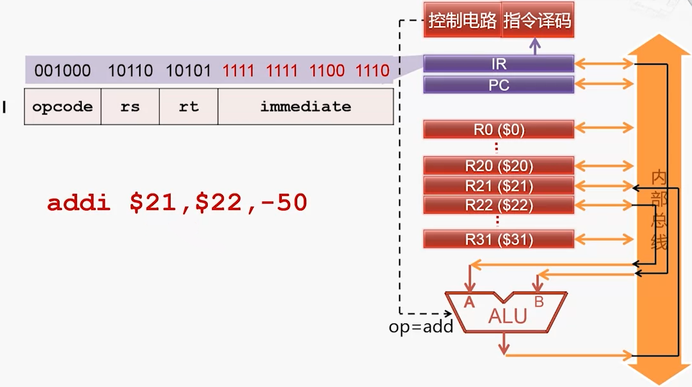

    - `addi rt, ts, imm # R[rt] = R[rs] + SignExtImm` (1, 2)
    - `addiu rt, rs, imm # R[rt] = R[rs] +SignExtImm` (2)

    (1) May cause overflow exception

    (2) `SignExtImm = {16{imm[15]}, imm}`（符号扩展）

- 逻辑运算指令 MIPS Core Instruction Set

  - R型

    - `and rd, rs, rt # R[rd] = R[rs] & R[rt]`
    - `or rd, rs, rt # R[rd] = R[rs] | R[rt]`
    - `nor rd, rs, rt # R[rd] = ~ (R[rs] | R[rt])`

  - I型

    - `andi rt, rs, imm # R[rt] = R[rs] & ZeroExtImm` (3)
    - `ori rt, rs, imm # R[rt] = R[rs] | ZeroExtImm` (3)

    (3) `ZeroExtImm = {16{1'b0}, imm}`（零扩展）

- 算术逻辑运算的需求

  - 算术运算
    - 两个32—bit数的加法，结果为一个32-bit数
    - 两个32-bit数的减法，结果为一个32-bit数
    - 检查加减法的结果是否溢出
  - 逻辑运算
    - 两个32-bit数的“与”操作，结果为一个32-bit数
    - 两个32-bit数的“或”操作，结果为一个32-bit数
    - 两个32-bit数的“或非”操作，结果为一个32-bit数

### 3.2 门电路的基本原理

- 晶体管 transistor：现代集成电路中通常使用MOS晶体管（Metal-Oxide-Semiconductor：金属-氧化物-半导体）

  |              |                  **N型MOS管**                   |                  **P型MIS管**                   |
  | :----------: | :---------------------------------------------: | :---------------------------------------------: |
  |  **电路图**  |  |  |
  | **导通条件** |                Gate端连接高电平                 |                Gate端连接低电平                 |

- CMOS集成电路 Complementary MOS：由PMOS和NMOS共同构成的互补型MOS集成电路

- 门电路的实现

  |                  |                  非门 NOT gate                  |                        与门 AND gate                         |                       与非门 NAND gate                       |                  或门 OR gate                   |             异或门 Exclusive-OR gate / XOR gate              |
  | :--------------: | :---------------------------------------------: | :----------------------------------------------------------: | :----------------------------------------------------------: | :---------------------------------------------: | :----------------------------------------------------------: |
  |   **逻辑符号**   |  |       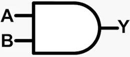        |       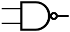        | 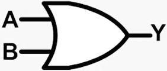 |       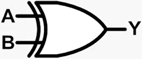        |
  |    **真值表**    | 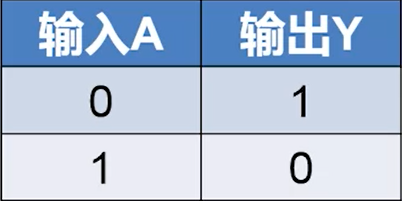 |       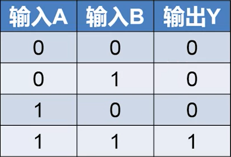        |       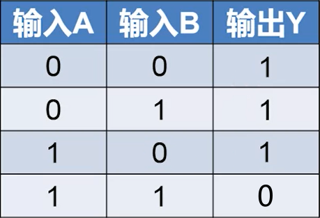        |  |       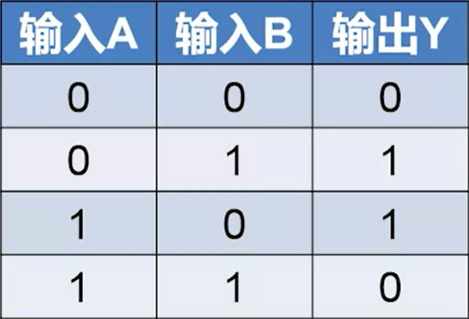        |
  | **逻辑函数表示** |       $Y=\bar{A}$（$Y=\sim{A}$，$Y=!A$）        |                         $Y=A\cdot B$                         | $Y=\overline{AB}=\overline{A\cdot B}=A\bar{\wedge}B=\overline{A\wedge B}$ |                     $Y=A+B$                     | $Y=A\otimes B=(\bar{A}\cdot B)+(A\cdot\bar{B})$（$Y=A \char`\^B$） |
  |   **工作过程**   | 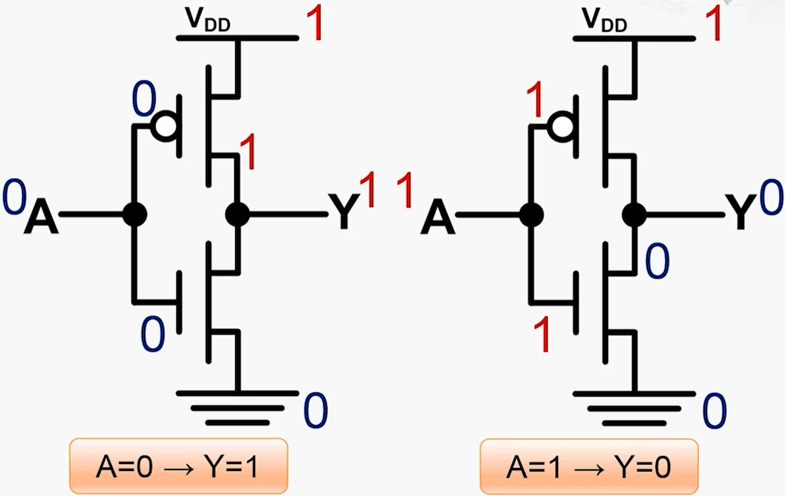 | 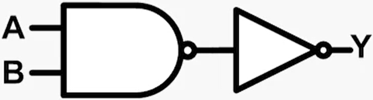<br/>（实际用“与非门”和“非门”实现“与门”) |       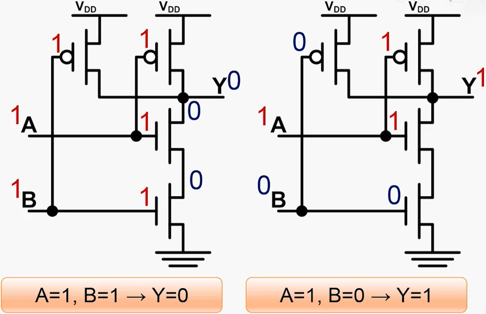        | 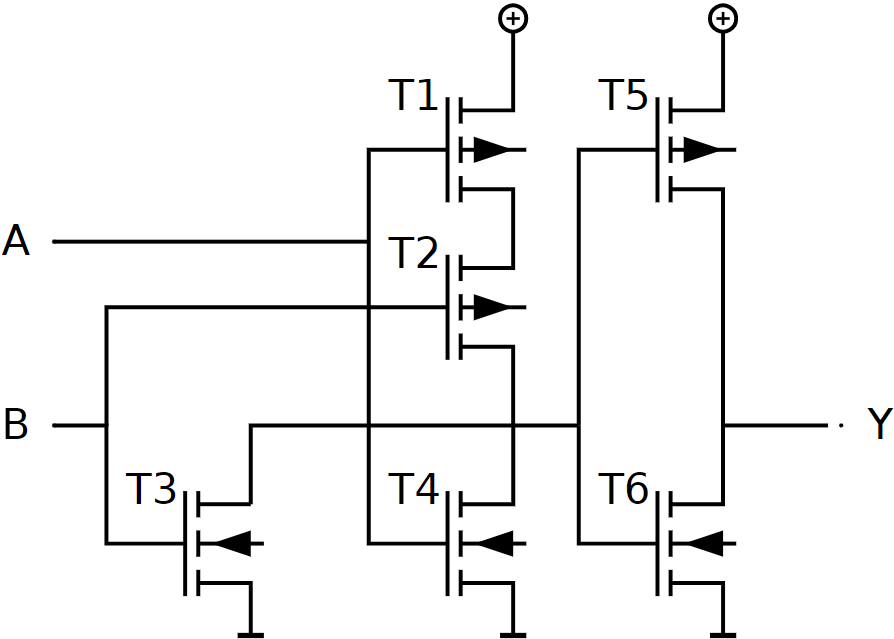 |                   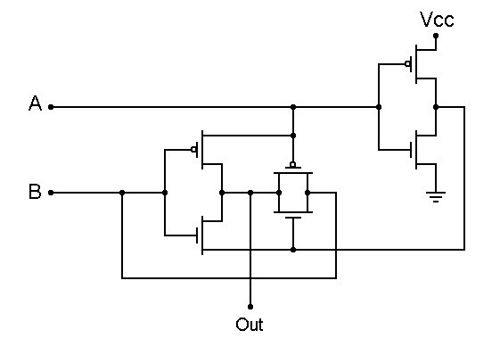                   |

### 3.3 寄存器的基本原理

- 寄存器的内部结构

  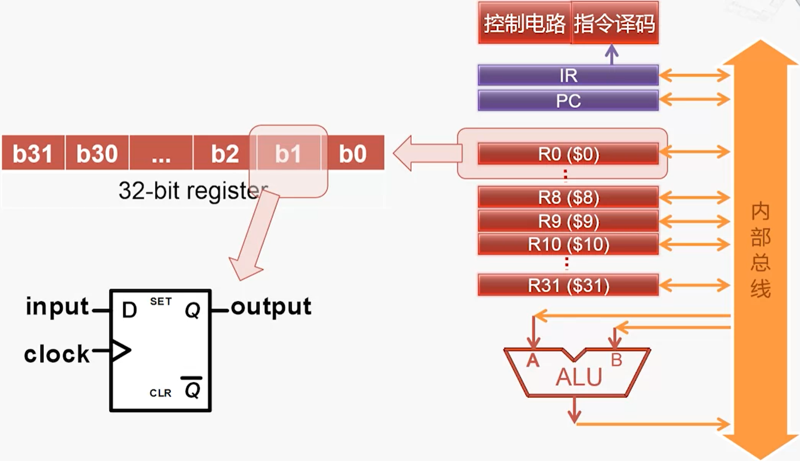

  * 32个D触发器：仅为原理性说明

  - D触发器 D flip-flop / DFF

    - 具有存储信息能力的基本单元

    - 由若干逻辑门构成，有多种实现方式

    - 主要有一个数据输入、一个数据输出和一个时钟输入

    - 在时钟clock的上升沿（0→1，低电平→高电平），经过clock to Q的时间，采样输入D的值，传送到输出Q，其余时间输出Q的值不变

      - 时钟频率（如约定每十秒钟会来按一次快门→时钟频率0.1Hz）
      - 要求输入信号在时钟上升沿之前有一段很短的稳定时间（set up时间），在时钟上升沿之后也需要有一段很短的稳定时间（hold时间）：对于D触发器来说，在时钟上升沿前后很短的时间内，输入端的信号不能发生变化，否则就可能造成无法正确的采样
      - 在一个复杂的系统中有很多的D触发器用各种不同的方式相连，就可以在不同的触发器中存放不同的信息， 并在时钟的控制下进行传递，而在时钟上升沿没有到来的时候， 无论输入发生什么样的变化都不会影响到后面触发器的输出

    - 时序图

      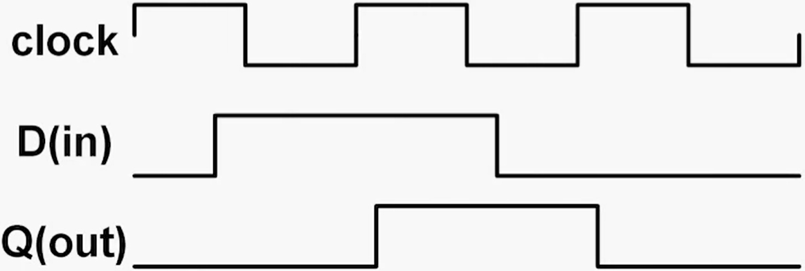

      时钟周期：两个上升沿之间的间隔时间

### 3.4 逻辑运算的实现

- 与运算的实现：`and rd, ts, r`

  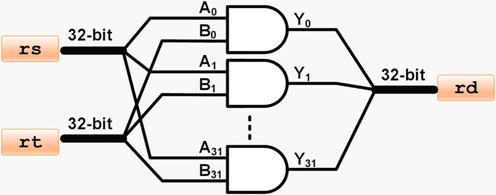

- 或运算的实现：`or rd, ts, r`

  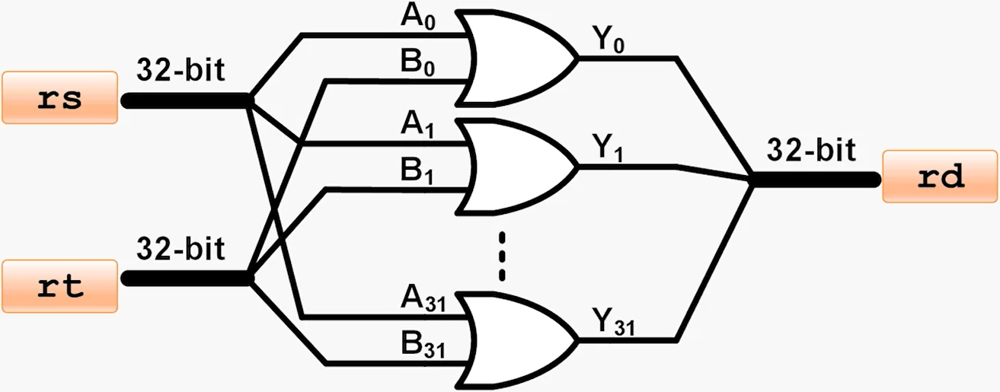

- 包含多种功能的运算单元：假设四种运算类型

  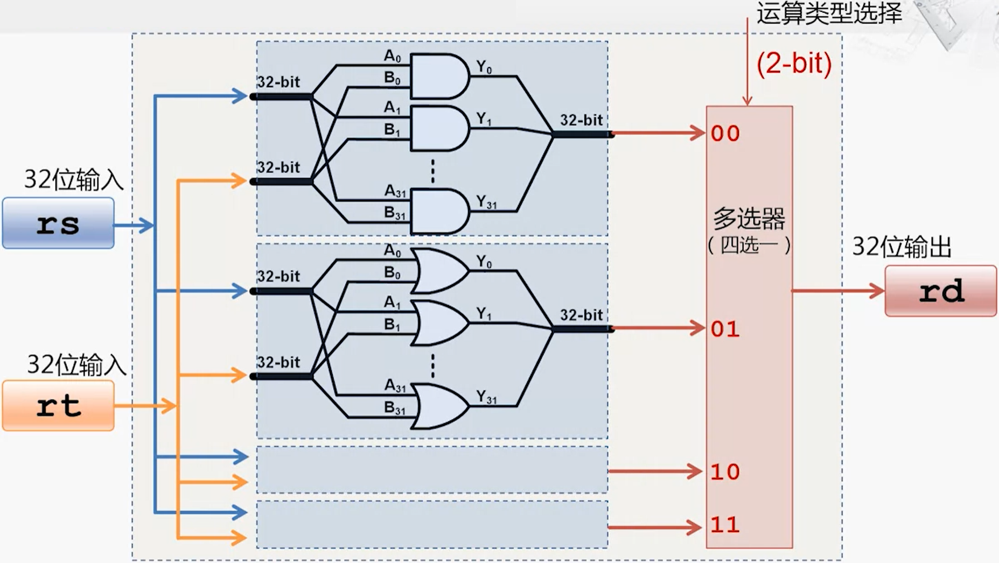

  - 逻辑运算示例

    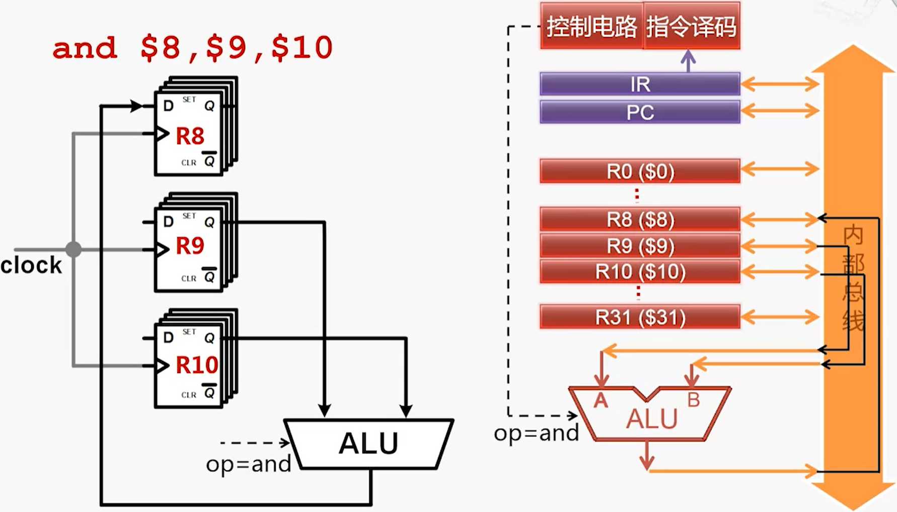

### 3.5 加法和减法的实现

- 二进制的加法

  | 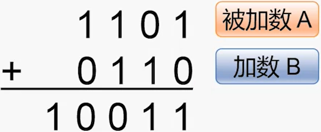 | 两个4-bit二进制数相加：<br>1. 两个1-bit二进制数相加<br>2. 进位参与输入运算<br>3. 可以产生进位输出 |
  | ----------------------------------------------- | ------------------------------------------------------------ |

- 半加器 Half Adder：将两个一位二进制数相加

  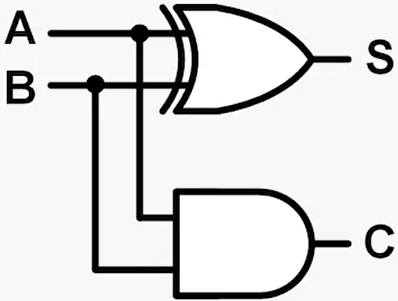

  | A    | B    | C    | S    |
  | ---- | ---- | ---- | ---- |
  | 0    | 0    | 0    | 0    |
  | 0    | 1    | 0    | 1    |
  | 1    | 0    | 0    | 1    |
  | 1    | 1    | 1    | 0    |

  - 输入端口A、B
  - 输出端口S（和）、C（进位）
  - 不能将低位产生的进位作为输入参与运算

- 全加器 Full Adder：由两个半加器构成

  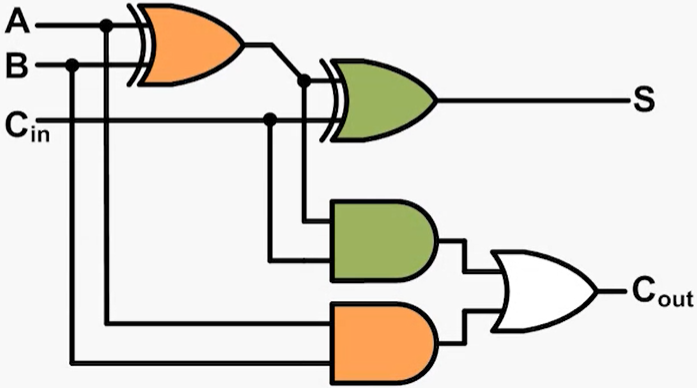

  | A    | B    | $C_{in}$ | $C_{out}$ | S    |
  | ---- | ---- | -------- | --------- | ---- |
  | 0    | 0    | 0        | 0         | 0    |
  | 0    | 1    | 0        | 0         | 1    |
  | 1    | 0    | 0        | 0         | 1    |
  | 1    | 1    | 0        | 1         | 0    |
  | 0    | 0    | 1        | 0         | 1    |
  | 0    | 1    | 1        | 1         | 0    |
  | 1    | 0    | 1        | 1         | 0    |
  | 1    | 1    | 1        | 1         | 1    |

  - 输入端口A、B、$C_{in}$（进位输入）

  - 输出端口S（和）、$C_{out}$（进位输出）

  - 4-bit加法器

    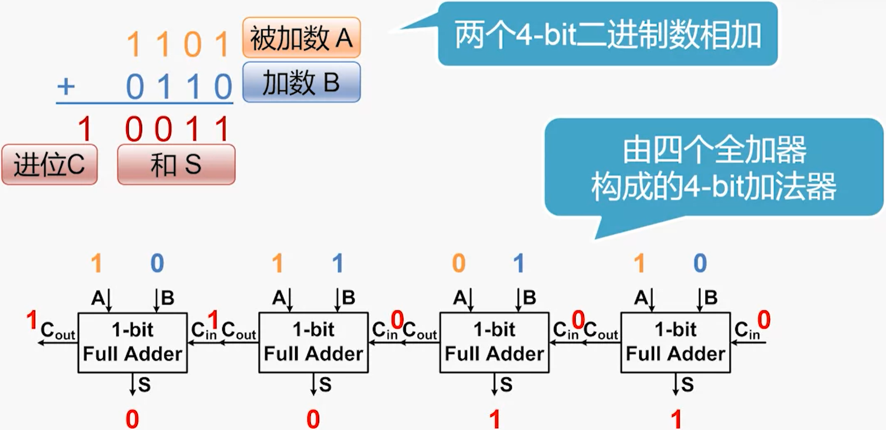

- 加法运算的实现

  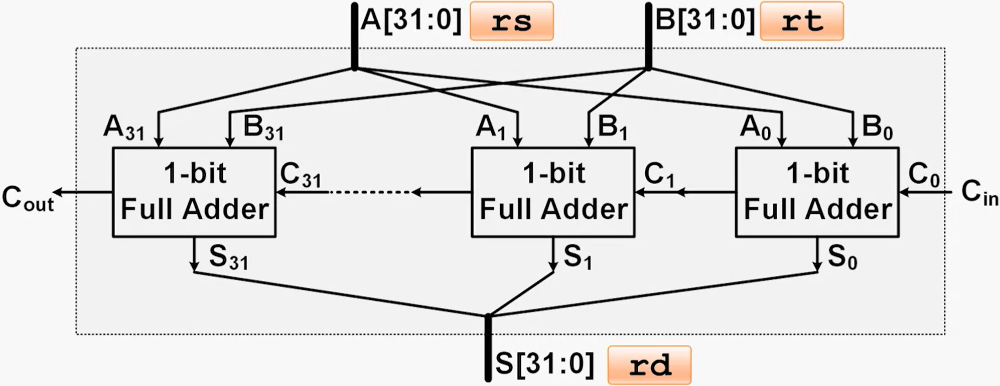

  - 检查加法运算结果是否溢出（溢出 overflow：运算结果超出了正常的表示范围）

    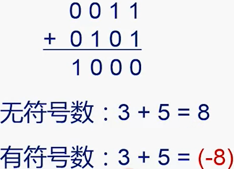

    - 仅针对有符号数运算

      - 两个正数相加，结果为负数
      - 两个负数相加，结果为正数

    - 进位$\nLeftrightarrow$溢出

      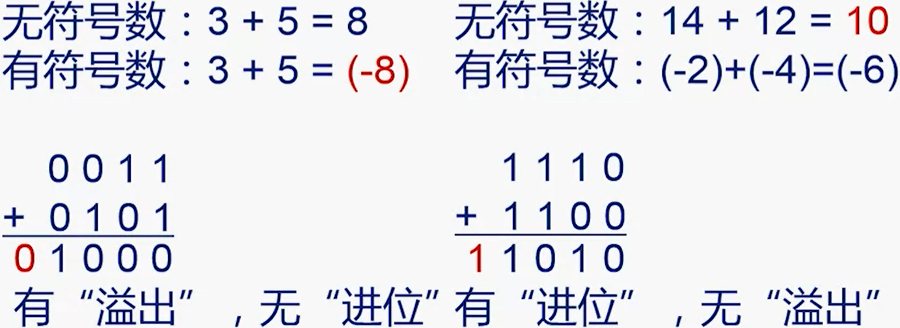

    - 溢出的检查方法：最高位的进位输入**不等于**最高位的进位输出

      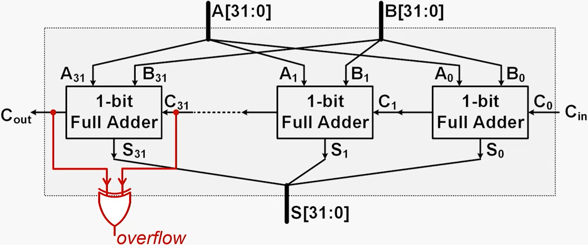

    - 对“溢出”的处理方式（MIPS）：提供两类不同的指令分别处理

      - 将操作数看做有符号数，发生“溢出”时产生异常
        - `add rd, rs, rt # R[rd] = R[rs] + R[rt]`
        - `addi rt, rs, imm # R[rt] = R[rs] + SignExtImm`
      - 将操作数看做无符号数，不处理“溢出”
        - `addu rd, rs, rt # R[rd] = R[rs] + R[rt]`
        - `addiu rt, rs, imm # R[rt] = R[rs] + SignExtImm` 

    - 对“溢出”的处理方式（x86）：溢出标志 OF（Overflow Flag ）

      - 若发生溢出，则自动设置OF=1；否则，OF=0

- 减法运算

  - 减法运算均可转换为加法运算：$A-B=A+(-B)$

  - 补码表示的二进制数的相反数：**按位取反，末位加一**

    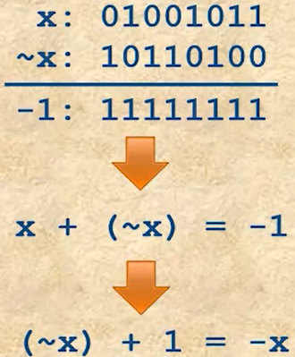

    - 正数的原码=补码；负数如-3，原码1011，符号位不变，其余各位取反，末位加1：1100+1=1101

  - 在加法器的基础上实现减法器：$A+(-B)=A+(\textasciitilde B+1)$
  
    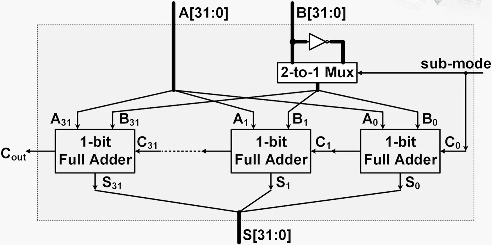


### 3.6 加法器的优化

- 行波进位加法器 Ripple-Carry Adder，RCA

  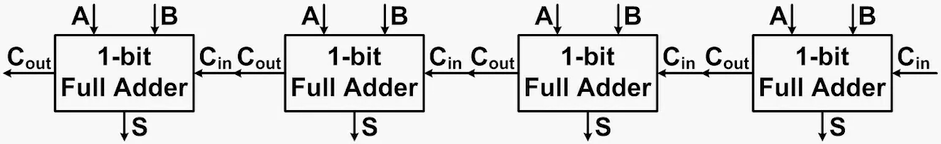

  - 结构特点：低位全加器的$C_{out}$连接到高一位全加器$C_{in}$

  - 优点：电路布局简单，设计方便

  - 缺点：高位的运算必须等待地位的运算完成，延迟时间长

    - 性能分析：4-bit RCA的门电路实现中的关键路径（延迟最长的路径）

      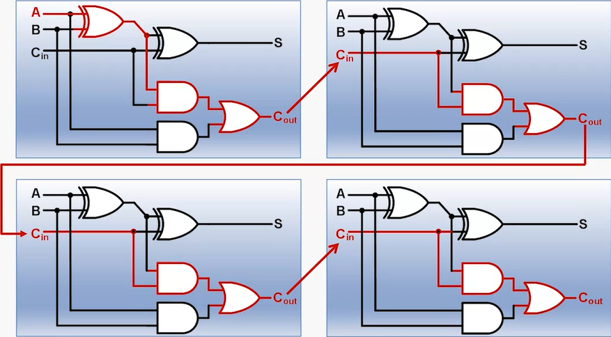

      - 线延迟、门延迟：在进行设计原理分析时，主要关注门延迟（T）

      - 总延迟时间：$(T+T)\times4+T=9T \to (T+T)\times n+T=(2n+1)T$

      - 32-bit RCA的性能分析

        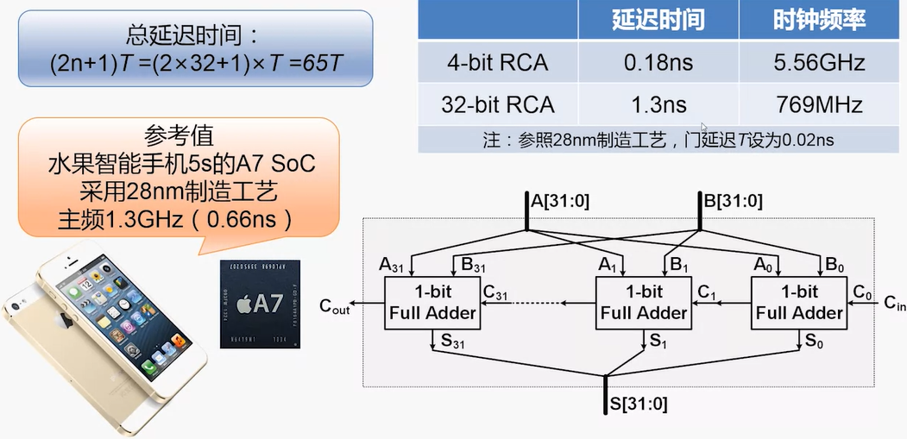

- 加法器的优化思路：高位的运算必须等待低位的“进位输出信号”→能否提前计算出“进位输出信号”？

  - 进位输出信号的分析

    - $C_{i+1}=(A_i\cdot B_i)+(A_i\cdot C_i)+(B_i\cdot C_i)=(A_i\cdot B_i)+(A_i+B_i)\cdot C_i$：$A_i,B_i,C_i$中任意两个为1，则进位为1
    - 设生成（Generate）信号$G_i=A_i\cdot B_i$、传播（Propagate）信号$P_i=A_i+B_i$：均已知
    - 则$C_{i+1}=G_i+P_i\cdot C_i$
      - $C_{1}=G_{0}+P_{0}\cdot C_{0}$
      - $C_{2}=G_{1}+P_{1}\cdot C_{1}=G_{1}+P_{1}\cdot(G_{0}+P_{0}\cdot C_{0})=G_{1}+P_{1}\cdot G_{0}+P_{1}\cdot P_{0}\cdot C_{0}$
      - $C_{3}=G_{2}+P_{2}\cdot C_{2}=G_{2}+P_{2}\cdot(G_{1}+P_{1}\cdot G_{0}+P_{1}\cdot P_{0}\cdot C_{0})=G_{2}+P_{2}\cdot G_{1}+P_{2}\cdot P_{1}\cdot G_{0}+P_{2}\cdot P_{1}\cdot P_{0}\cdot C_{0}$
      - $C_{4}=G_{3}+P_{3}\cdot C_{3}=G_{3}+P_{3}\cdot(G_{2}+P_{2}\cdot G_{1}+P_{2}\cdot P_{1}\cdot G_{0}+P_{2}\cdot P_{1}\cdot P_{0}\cdot C_{0})=G_{3}+P_{3}\cdot G_{2}+P_{3}\cdot P_{2}\cdot G_{1}+P_{3}\cdot P_{2}\cdot P_{1}
        \cdot G_{0}+P_{3}\cdot P_{2}\cdot P_{1}\cdot P_{0}\cdot C_{0}$

  - 提前计算$C_4$的电路实现

    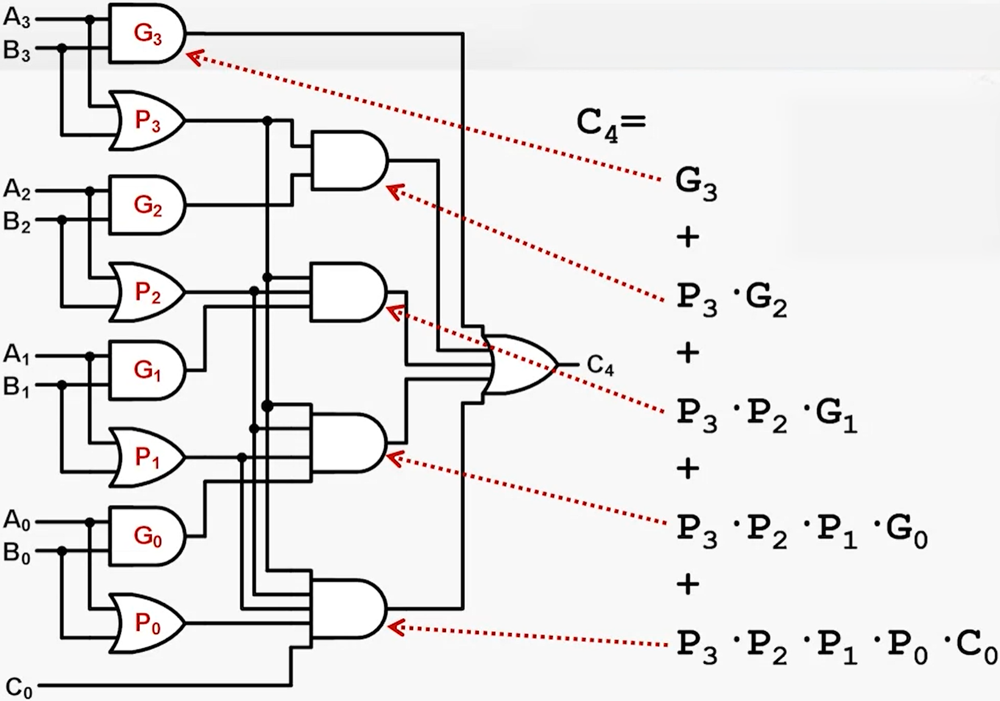

    - 优点：计算$C_{i+1}$的延迟时间固定为三级门延迟，与加法器的位数无关
    - 缺点：如果进一步拓宽加法器的位数，则电路变得非常复杂

  - 超前进位加法器 Carry-Lookahead Adder，CLA

    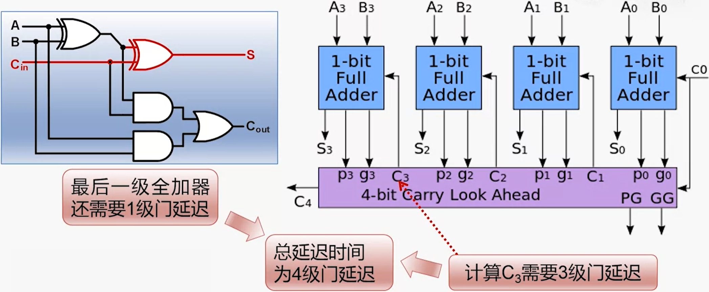

    \* 4-bit RCA总延迟时间为9T

    - 32-bit加法器采用行波进位总延迟时间为65T，而采用完全的超前进位理想的总延迟时间为4T，但实际上电路过于复杂而难以实现

    - 通常采用多个小规模的CLA拼接而成（如用4个8-bit的CLA以RCA的方式连接）

      |                | 延迟时间 | 时钟频率 |
      | -------------: | :------: | :------: |
      | **32-bit RCA** |  1.3ns   |  769MHz  |
      |    **单个CLA** |  0.08ns  |    /     |
      |     **4级CLA** |  0.26ns  | 3.84GHz  |

      \* 注：参照28nm制造工艺，门延迟设为0.02ns

## 第四讲  乘法器和除法器（Multiplier and Divider）

> 内容要点：乘法运算，乘法器的实现，除法运算，除法器的实现

### 4.1 乘法的运算过程


## 第五讲  单周期处理器（Single Cycle Processor）

内容要点：控制器，数据通路

## 第六讲  流水线处理器（Pipelined Processor）

内容要点：流水线，相关和冒险

## 第七讲  存储层次结构（Memory Hierarchy）

内容要点：高速缓存，主存

## 第八讲  中断与异常（Interruption and Exception）

内容要点：中断与异常的异同，中断处理的过程

## 第九讲  输入输出设备（Input/Output Devices）

内容要点：基本的输入输出控制方式，常用的输入输出设备类型